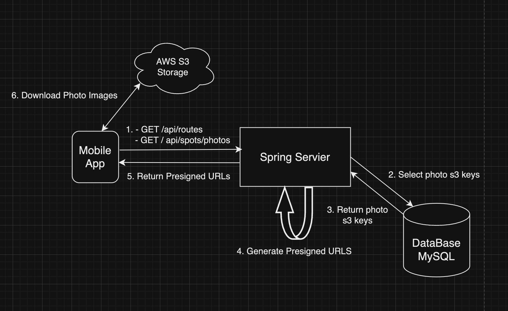

# 1. Project OdysseyLog

- 여행 일지를 기록하고 공유하는 App Server.
- AWS S3 Storage를 이용하기 위해 Presigned URL을 사용하여 이미지 GET, POST를 구현.
- AWS Lambda를 이용하여 이미지 리사이징을 구현.
- App에서 사용하는 API를 Spring Boot로 구현.

# 2. Development Environment

- Language: Kotlin, Dart
- Framework: Spring Boot, Flutter(https://github.com/gominnam/OdysseyLogApp)
- Database: MySQL
- AWS S3 Storage, Lambda(python 3.10)

# 3. Structure

- 설계 이미지  
    

- Moblie로부터 GET, POST 요청을 처리
- AWS S3 Storage에 이미지가 업로드
  - 이미지 업로드 완료가 Event Trigger로 AWS Lambda 호출
    - AWS Lambda를 통해 이미지 리사이징 
      - 리사이징이 완료되면 Spring 서버로 notification api를 호출하여 isCompressed 컬럼 상태를 업데이트

# 4. Presigned URL

- Why Presigend URL ?  

    - 보안: 클라이언트가 직접 AWS S3에 접근하는 것이 아니라 서버를 통해 제한된 시간 동안 
           유효한 URL을 제공받아 접근하므로 보안이 강화된다.  
  
    - 성능: 서버에서 이미지를 업로드하고 다운로드하는 것이 아니라 클라이언트가 직접 
           S3에 접근하므로 서버의 부하를 줄일 수 있다.  

    - 비용: 서버에서 데이터 전송 비용이 줄어들어 운영 비용을 절감할 수 있다.  

- Presigned URL GET, POST 흐름도  

     - POST 
         

     - GET 
         

# 5. Reference

- [AWS S3 Presigned URL](https://docs.aws.amazon.com/AmazonS3/latest/userguide/PresignedUrlUploadObject.html)
- [AWS LABMDA](https://docs.aws.amazon.com/lambda/latest/dg/welcome.html)